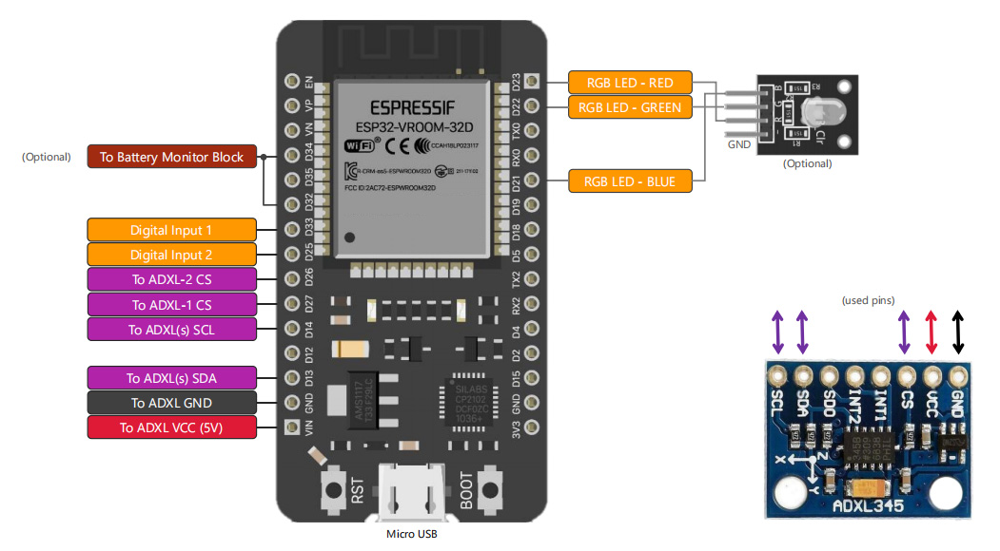
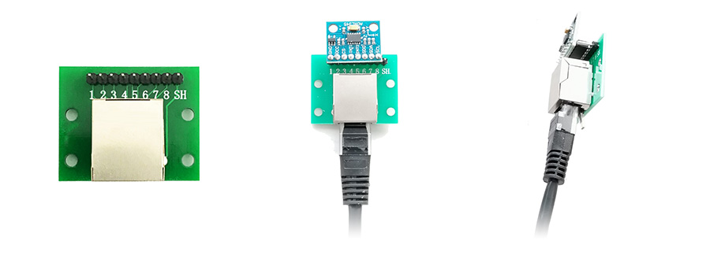

# HS-ACC WiFi Accellerometer - NO PCB Built
It is suggested to <a href="https://t.me/hscope" target="_blank">join the Telegram group</a> to get support on this project.

## Required parts
- x1 **ESP32-WROOM Development Board** (with chip ESP32-WROOM-32 version 1 or up, or ESP32-WROOM-32D or ESP32-WROOM-32E)
- x1 (or x2) **ADXL345 Module**
- x1 **RGB LED Module** (optional)
 
## Connections Schematic
 
 
### Pinout
<table style="width:45%; float:left; margin-right:12px"><thead><tr><th class="has-text-align-center" data-align="center">Sensor 1 (ADXL345) Pin</th><th class="has-text-align-center" data-align="center">ESP32 Pin</th></tr></thead><tbody><tr><td class="has-text-align-center" data-align="center">GND</td><td class="has-text-align-center" data-align="center">GND</td></tr><tr><td class="has-text-align-center" data-align="center">VCC</td><td class="has-text-align-center" data-align="center">VIN (5V)</td></tr><tr><td class="has-text-align-center" data-align="center">CS</td><td class="has-text-align-center" data-align="center">D27 (IO27 or GPIO27)</td></tr><tr><td class="has-text-align-center" data-align="center">SDA</td><td class="has-text-align-center" data-align="center"> D13 (IO13 or GPIO13) </td></tr><tr><td class="has-text-align-center" data-align="center">SCL</td><td class="has-text-align-center" data-align="center"> D14 (IO14 or GPIO14)  </td></tr></tbody></table>

<table style="width:45%; float:left; margin-right:12px"><thead><tr><th class="has-text-align-center" data-align="center">Sensor 2 (ADXL345) Pin</th><th class="has-text-align-center" data-align="center">ESP32 Pin</th></tr></thead><tbody><tr><td class="has-text-align-center" data-align="center">GND</td><td class="has-text-align-center" data-align="center">GND</td></tr><tr><td class="has-text-align-center" data-align="center">VCC</td><td class="has-text-align-center" data-align="center">VIN (5V)</td></tr><tr><td class="has-text-align-center" data-align="center">CS</td><td class="has-text-align-center" data-align="center">D26 (IO26 or GPIO26)</td></tr><tr><td class="has-text-align-center" data-align="center">SDA</td><td class="has-text-align-center" data-align="center"> D13 (IO13 or GPIO13) </td></tr><tr><td class="has-text-align-center" data-align="center">SCL</td><td class="has-text-align-center" data-align="center"> D14 (IO14 or GPIO14)  </td></tr></tbody></table>

## Long Wiring Setup
In case you need to use long wires for the sensors, it is suggested to use **Ethernet cables** for the connections. In addition you can use also a **RJ45 Breakout Board** as the following:

 